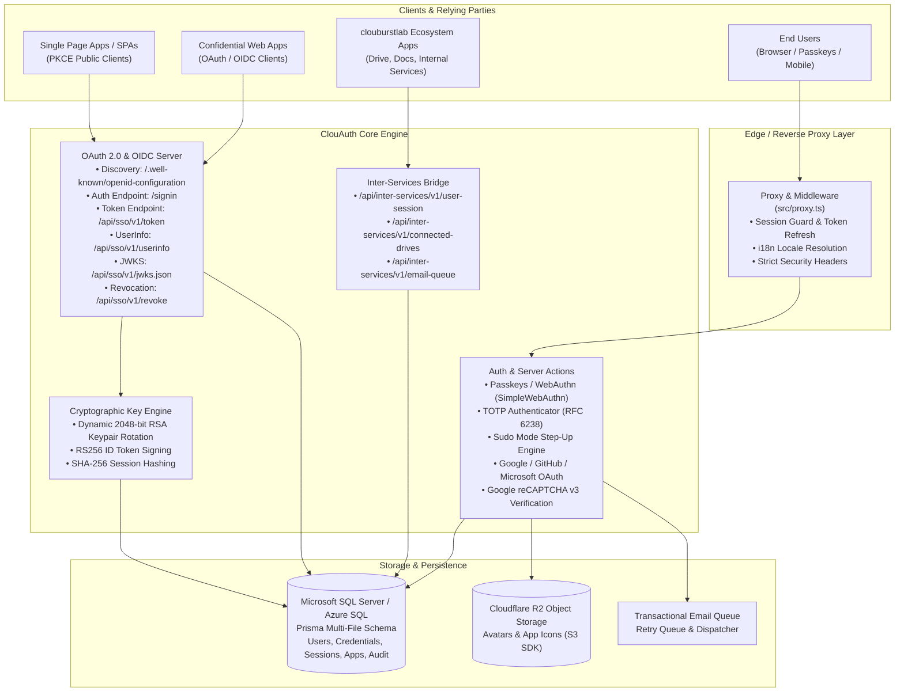
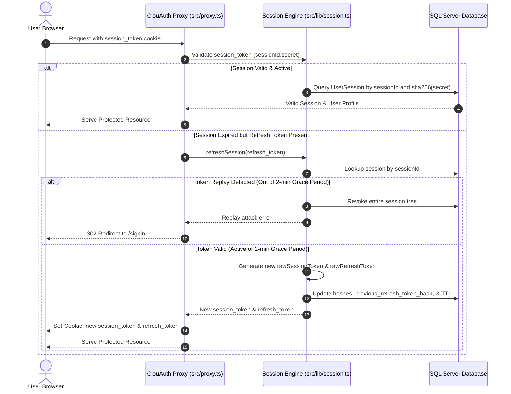

# 🏛️ ClouAuth Architecture & System Design

ClouAuth is a centralized, enterprise-grade **Authentication and OpenID Connect (OIDC 1.0) / OAuth 2.0 Identity Provider (IdP)** designed as the backbone authentication authority for the **clouburstlab** ecosystem and third-party developer applications.

---

## 📐 High-Level System Architecture

ClouAuth combines an edge-capable **Next.js 16 (React 19)** App Router architecture with a secure **Microsoft SQL Server / Azure SQL** persistence layer, **Cloudflare R2** object storage, and modular cryptographic microservices.

---

## 🔐 Authentication & Security Model

### 1. Multi-Factor Authentication (MFA / 2FA)
ClouAuth enforces a defense-in-depth model with multiple verification methods:
- **Passkeys (FIDO2 / WebAuthn):** Native passwordless and multi-factor biometric authentication implemented via `@simplewebauthn/server` and `@simplewebauthn/browser`. Includes authenticator signature counter tracking to detect authenticator cloning.
- **Time-Based One-Time Password (TOTP):** Fully compliant with RFC 6238 (Google Authenticator, Authy, 1Password) with AES-encrypted shared secrets and clock drift tolerance.
- **SMS & Email 6-Digit OTP:** High-entropy verification codes hashed with SHA-256 before storage, accompanied by exponential lockout backoff to mitigate brute-force attempts.
- **Emergency Recovery Codes:** 10 single-use cryptographically random recovery codes hashed in the database, enabling emergency account recovery if primary 2FA devices are lost.

### 2. Sudo Mode (Step-Up Authentication)
Sensitive actions (such as generating recovery codes, updating passwords, modifying OAuth developer client secrets, and account deletion) require the user to enter **Sudo Mode**. 
- A temporary, time-bounded challenge token (TTL: 15 minutes) is generated after re-verifying credentials or passkeys.
- The state is cryptographically bound to the current session and verified before executing privileged server actions (`src/actions/auth/sudo.actions.ts`).

### 3. Session Lifecycle & Token Rotation
ClouAuth utilizes an opaque, compound session token model rather than naive stateless JWTs for primary user sessions:

Key security mechanisms of the session architecture:
- **Compound Token Structure:** `sessionToken` = `${sessionId}.${randomHex}`. The database only stores `sha256(randomHex)`. Even full database read access does not leak usable session cookies.
- **Timing-Safe Comparison:** All token matching uses `crypto.timingSafeEqual` to eliminate timing side-channel attacks.
- **Refresh Token Rotation & Replay Detection:** Every token refresh revokes the existing refresh token and generates a new pair. If an older refresh token is presented outside a **2-minute grace period** (designed to absorb network retries and race conditions), the entire session family is immediately revoked as a suspected replay attack.
- **Device & Geolocation Fingerprinting:** Sessions capture user-agent, operating system, browser, IP address, and a long-lived device identifier (`clou_device_id`) to alert users to unrecognized logins.

---

## 🌐 OpenID Connect (OIDC) & OAuth 2.0 Server

ClouAuth functions as a certified-compliant Identity Provider exposing standard discovery and endpoint contracts:

### Discovery Document
Available at `/.well-known/openid-configuration`:
- **Issuer:** `https://auth.clouburstlab.com`
- **Supported Response Types:** `code`
- **Supported Grant Types:** `authorization_code`, `refresh_token`, `client_credentials`
- **Signing Algorithm:** `RS256`
- **PKCE Code Challenge:** `S256` (RFC 7636 mandatory for public clients)
- **Token Endpoint Auth Methods:** `client_secret_basic`, `client_secret_post`, `none`

### Asymmetric Key Management (RS256 JWKS)
- ClouAuth manages 2048-bit RSA key pairs dynamically generated via `jose`.
- Private keys sign OIDC ID tokens; public keys are exported as JSON Web Keys (JWK) and published at `/api/sso/v1/jwks.json`.
- Automatic key rotation is supported with zero client downtime by preserving active and valid historical keys in the `SigningKey` table.

---

## 🗄️ Database Architecture (Prisma Multi-File Schema)

The database schema is partitioned into modular Prisma schemas located in `prisma/schema/`:

| Module Schema | Description | Key Models |
| :--- | :--- | :--- |
| `base.prisma` | Generator & SQL Server datasource configuration | Prisma Client generator, SQL Server datasource |
| `user.prisma` | Core user identity, contact points, profile data | `User`, `UserEmail`, `UserPhone`, `Address`, `AccountStatus` |
| `auth.prisma` | Credentials, passwords, passkeys, TOTP, signing keys | `PasswordCredential`, `PasswordHistory`, `RecoveryCode`, `TwoFactor`, `PasskeyCredential`, `TotpMethod`, `OAuthAccount`, `SigningKey` |
| `session.prisma` | User sessions, temporary flow state, token blocklist | `UserSession`, `TempSession`, `RevokedToken` |
| `app.prisma` | Developer OAuth applications & client configurations | `UserApp`, `OAuthClientConfig` |
| `security_activity.prisma` | Audit trail for security events and logins | `SecurityActivity` |
| `audit.prisma` | System-wide administrative audit logs | `AuditLog` |
| `preferences.prisma` | User UI themes, locales, and notification preferences | `UserPreference`, `NotificationPreference` |
| `queue.prisma` | Asynchronous transactional email delivery queue | `EmailQueue` |
| `graveyard.prisma` | Soft-deleted user tombstone records for compliance | `Graveyard` |

---

## 🔗 Inter-Services Bridge & Microservices

ClouAuth powers single sign-on across the entire **clouburstlab** portfolio (including Cloudburst Drive and Workspace):
- **`/api/inter-services/v1/user-session`:** Validates cross-subdomain sessions (`*.clouburstlab.com`) via cookies or machine-to-machine bearer tokens. Supports granular field scoping (`id`, `username`, `email`, `avatar`).
- **`/api/inter-services/v1/connected-drives`:** Securely stores and refreshes upstream OAuth tokens for third-party cloud drives (Google Drive, Microsoft OneDrive, Dropbox) on behalf of internal services.
- **`/api/inter-services/v1/email-queue`:** Decoupled asynchronous email delivery pipeline with exponential backoff and retry tracking.
